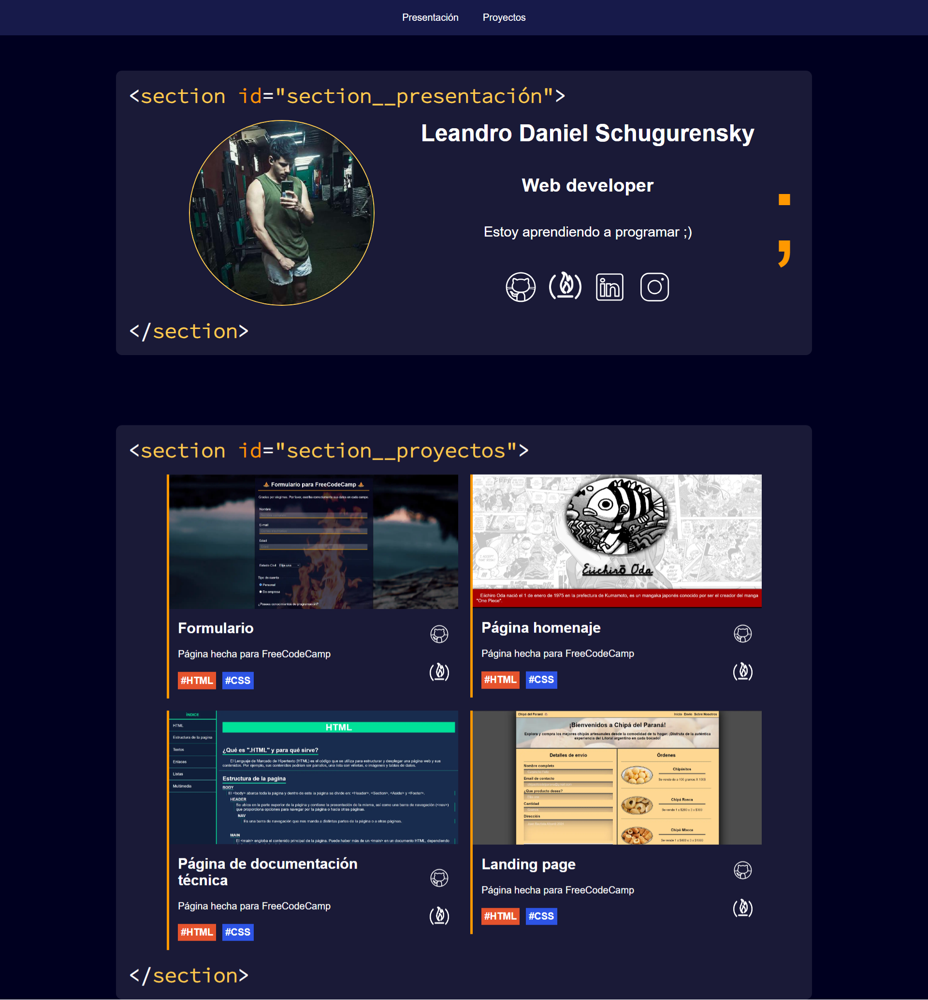
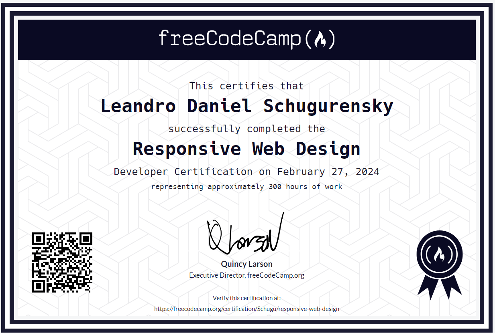

<h1 align='center'>🌟 Proyecto final N°5 del curso Responsive Web Design de FreeCodeCamp 🌟</h1>

> Este proyecto es 5/5 para la certificación del curso. :sparkles:

## Página Portafolio Personal 💼🖥️
🎯 Objetivo: Construir una aplicación que sea funcionalmente similar a https://personal-portfolio.freecodecamp.rocks. No copies este proyecto de demostración.

### Historias de usuario (Descripción) 📋
1. Tu portafolio debe tener una sección de bienvenida con un <code>id</code> de <code>welcome-section</code>.
2. La sección de bienvenida debe tener un elemento <code>h1</code> que contenga texto.
3. Tu portafolio debe tener una sección de proyectos con un <code>id</code> de <code>projects</code>.
4. La sección de proyectos debe tener al menos un elemento con una <code>class</code> de <code>project-tile</code> para tener un proyecto.
5. La sección de proyectos debe tener al menos un enlace a un proyecto.
6. Tu portafolio debe tener una barra de navegación con un <code>id</code> de <code>navbar</code>.
7. La barra de navegación debe tener al menos un enlace donde puedas hacer clic para navegar a diferentes secciones de la página.
8. Tu portafolio debe tener un enlace con un <code>id</code> de <code>profile-link</code>, el cual abra tu GitHub o perfil de freeCodeCamp en una pestaña nueva.
9. Tu portafolio debe tener al menos una consulta de medios.
10. La altura de la sección de bienvenida debe ser igual a la altura de viewport.
11. La barra de navegación siempre debe estar en la parte superior del viewport.

### Pruebas (Pruebas Técnicas a pasar) ✔️🔬 
- 🧪 Tu portafolio debe tener una sección "<code>Welcome</code>" con un <code>id</code> de <code>welcome-section</code>.
- 🧪 Tu elemento <code>#welcome-section</code> debe contener un elemento <code>h1</code>.
- 🧪 No debes tener ningún elemento <code>h1</code> vacío dentro del elemento <code>#welcome-section</code>.
- 🧪 Debes tener una sección "<code>Projects</code>" con un <code>id</code> de <code>projects</code>.
- 🧪 Tu portafolio debe contener al menos un elemento con una clase <code>project-tile</code>.
- 🧪 Tu elemento <code>#projects</code> debe contener al menos un elemento <code>a</code>.
- 🧪 Tu portafolio debe tener una barra de navegación con un <code>id</code> de <code>navbar</code>.
- 🧪 Tu elemento <code>#navbar</code> debe contener al menos un elemento <code>a</code> cuyo atributo <code>href</code> empiece con <code>#</code>.
- 🧪 Tu portafolio debe tener un elemento <code>a</code> con un <code>id</code> de <code>profile-link</code>.
- 🧪 Tu elemento <code>#profile-link</code> debe tener un atributo <code>target</code> de <code>_blank</code>.
- 🧪 Tu portafolio debe usar al menos una consulta de medios.
- 🧪 Tu elemento <code>#navbar</code> siempre debe estar en la parte superior del viewport.
  
------------

### Instalación 🛠️💻

Sigue estos pasos para clonar y ejecutar el proyecto localmente:

1. Clona este repositorio en tu máquina local utilizando Git:

    ```bash
    git clone https://github.com/Schugu/ProyectoFinalFreeCodeCamp5.git
    ```

2. Navega al directorio del proyecto:

    ```bash
    cd ProyectoFinalFreeCodeCamp5
    ```

3. Una vez clonado el repositorio en tu máquina local, abre el archivo `index.html` en tu navegador web para ver el proyecto.

4. Si deseas personalizar los estilos de la página, puedes hacerlo modificando el archivo `styles.css`. Este archivo contiene todas las reglas de estilo que se aplican a la página. Abre el archivo `styles.css` en un editor de texto o IDE de tu elección, realiza los cambios que desees y guarda el archivo. Luego, recarga la página en tu navegador para ver los cambios aplicados.

------------

### Capturas de pantalla 📸


------------
<br><br><br>
<h2 align='center'>Certificado 🎓🏆🏅📜</h2>

